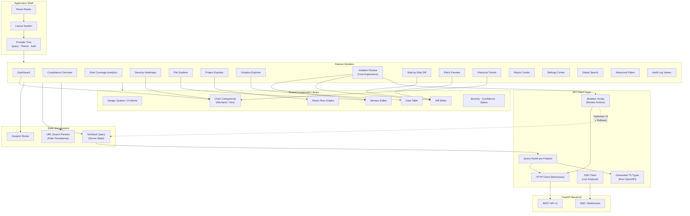
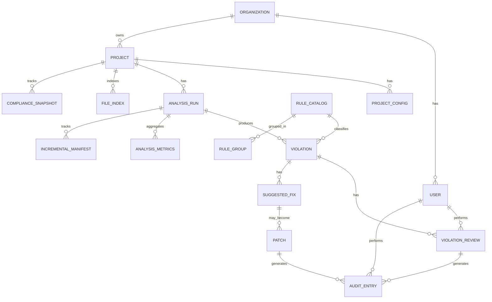
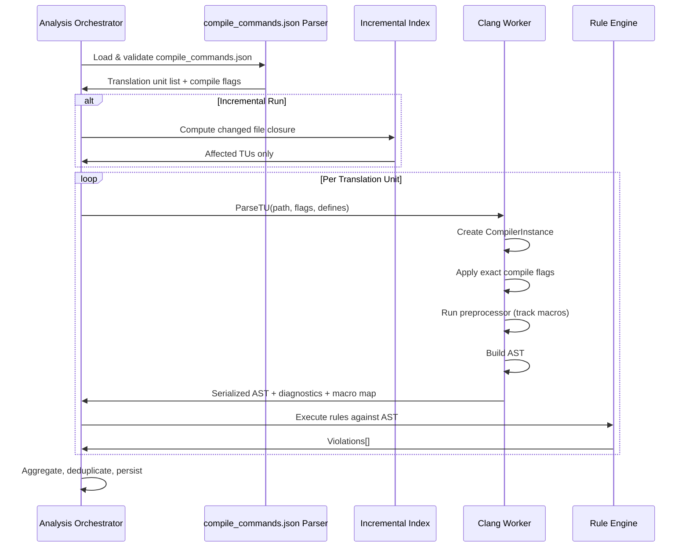

# MISRA C Compliance Platform — System Architecture Blueprint

**Version:** 1.0.0  
**Status:** Architecture Phase (Design Only)  
**Target Standards:** MISRA C:2012 (primary), MISRA C:2023 (extension path)  
**Classification:** Enterprise / Industrial-Grade Static Analysis Platform

---

## Executive Summary

This document defines the production architecture for a next-generation, AI-augmented MISRA C compliance platform designed to analyze real embedded C projects at commercial-tool scale. The system is built around **Clang LibTooling** for semantic analysis, a **plugin-based rule engine** for extensible standard coverage, and a **human-in-the-loop violation review workflow** where no code is ever modified automatically.

Core architectural tenets:

| Principle | Implication |
|-----------|-------------|
| **Never auto-modify code** | Fixes are suggestions only; patches require explicit human approval |
| **Audit everything** | Every review action is immutable and attributable |
| **Incremental by design** | Analysis is file-graph-aware and cache-friendly |
| **Plugin extensibility** | Rules, standards, and fix generators are hot-swappable modules |
| **Enterprise UX** | Frontend is a first-class product surface, not a report viewer |
| **PostgreSQL-ready** | SQLite for bootstrap; repository abstraction from day one |

---

## 1. Repository Folder Structure

```
misra-compliance-platform/
├── .github/
│   ├── workflows/
│   │   ├── ci-backend.yml
│   │   ├── ci-frontend.yml
│   │   ├── ci-clang-toolchain.yml
│   │   ├── release.yml
│   │   └── security-scan.yml
│   ├── CODEOWNERS
│   └── pull_request_template.md
│
├── docs/
│   ├── ARCHITECTURE.md                 # This document
│   ├── api/
│   │   ├── openapi-spec.md
│   │   └── versioning-policy.md
│   ├── adr/                            # Architecture Decision Records
│   │   ├── 0001-clang-libtooling.md
│   │   ├── 0002-plugin-rule-engine.md
│   │   ├── 0003-incremental-analysis.md
│   │   └── 0004-human-in-loop-patches.md
│   ├── database/
│   │   └── schema.md
│   ├── rule-engine/
│   │   ├── plugin-contract.md
│   │   └── misra-2012-coverage-matrix.md
│   └── runbooks/
│       ├── deployment.md
│       └── cross-compilation.md
│
├── infrastructure/
│   ├── docker/
│   │   ├── backend.Dockerfile
│   │   ├── frontend.Dockerfile
│   │   ├── clang-worker.Dockerfile
│   │   └── nginx.Dockerfile
│   ├── compose/
│   │   ├── docker-compose.yml
│   │   ├── docker-compose.dev.yml
│   │   ├── docker-compose.prod.yml
│   │   └── docker-compose.ci.yml
│   ├── k8s/                            # Future Kubernetes manifests
│   │   ├── base/
│   │   └── overlays/
│   └── scripts/
│       ├── bootstrap.sh
│       ├── migrate.sh
│       └── healthcheck.sh
│
├── backend/
│   ├── pyproject.toml
│   ├── alembic.ini
│   ├── alembic/
│   │   ├── env.py
│   │   └── versions/
│   │
│   ├── src/
│   │   └── misra_platform/
│   │       ├── __init__.py
│   │       ├── main.py                   # FastAPI application entry
│   │       │
│   │       ├── core/                     # Cross-cutting concerns
│   │       │   ├── config.py
│   │       │   ├── dependencies.py
│   │       │   ├── exceptions.py
│   │       │   ├── logging.py
│   │       │   ├── security.py
│   │       │   └── events.py             # Domain event bus
│   │       │
│   │       ├── api/                      # HTTP layer (thin controllers)
│   │       │   ├── v1/
│   │       │   │   ├── router.py
│   │       │   │   ├── projects.py
│   │       │   │   ├── analysis.py
│   │       │   │   ├── violations.py
│   │       │   │   ├── reviews.py
│   │       │   │   ├── patches.py
│   │       │   │   ├── reports.py
│   │       │   │   ├── rules.py
│   │       │   │   ├── audit.py
│   │       │   │   ├── settings.py
│   │       │   │   └── health.py
│   │       │   └── middleware/
│   │       │       ├── auth.py
│   │       │       ├── correlation_id.py
│   │       │       └── rate_limit.py
│   │       │
│   │       ├── domain/                   # Business entities & invariants
│   │       │   ├── models/
│   │       │   │   ├── project.py
│   │       │   │   ├── analysis_run.py
│   │       │   │   ├── violation.py
│   │       │   │   ├── review_action.py
│   │       │   │   ├── patch.py
│   │       │   │   ├── rule.py
│   │       │   │   ├── audit_entry.py
│   │       │   │   └── user.py
│   │       │   ├── enums/
│   │       │   │   ├── severity.py
│   │       │   │   ├── review_status.py
│   │       │   │   └── analysis_status.py
│   │       │   └── events/
│   │       │       ├── analysis_completed.py
│   │       │       ├── violation_reviewed.py
│   │       │       └── patch_approved.py
│   │       │
│   │       ├── services/                 # Application / use-case layer
│   │       │   ├── project_service.py
│   │       │   ├── analysis_orchestrator.py
│   │       │   ├── violation_service.py
│   │       │   ├── review_service.py
│   │       │   ├── patch_service.py
│   │       │   ├── report_service.py
│   │       │   ├── rule_catalog_service.py
│   │       │   ├── audit_service.py
│   │       │   └── incremental_cache_service.py
│   │       │
│   │       ├── repositories/             # Data access abstraction
│   │       │   ├── base.py
│   │       │   ├── sqlalchemy/
│   │       │   │   ├── project_repo.py
│   │       │   │   ├── violation_repo.py
│   │       │   │   ├── audit_repo.py
│   │       │   │   └── ...
│   │       │   └── interfaces/
│   │       │       ├── i_project_repository.py
│   │       │       └── i_violation_repository.py
│   │       │
│   │       ├── schemas/                  # Pydantic DTOs
│   │       │   ├── requests/
│   │       │   └── responses/
│   │       │
│   │       ├── workers/                  # Async job processors
│   │       │   ├── celery_app.py         # or ARQ / RQ
│   │       │   ├── analysis_worker.py
│   │       │   └── report_worker.py
│   │       │
│   │       └── integrations/
│   │           ├── redis/
│   │           │   ├── cache.py
│   │           │   └── pubsub.py
│   │           ├── clang_bridge/
│   │           │   ├── compile_commands.py
│   │           │   ├── ast_client.py
│   │           │   └── incremental_index.py
│   │           └── storage/
│   │               ├── local.py
│   │               └── s3.py             # Future object storage
│   │
│   └── tests/
│       ├── unit/
│       ├── integration/
│       └── fixtures/
│           └── sample_projects/
│
├── clang-worker/                         # Native C++ Clang LibTooling service
│   ├── CMakeLists.txt
│   ├── toolchain/
│   │   └── cross-compile-profiles/
│   ├── include/
│   │   └── misra_clang/
│   │       ├── ast_visitor.h
│   │       ├── compile_db.h
│   │       ├── incremental_engine.h
│   │       ├── macro_expansion.h
│   │       ├── preprocessor_tracker.h
│   │       └── json_serializer.h
│   ├── src/
│   │   ├── main.cpp                      # gRPC or IPC server
│   │   ├── compile_db_parser.cpp
│   │   ├── translation_unit_loader.cpp
│   │   ├── ast_serializer.cpp
│   │   ├── incremental_index.cpp
│   │   └── preprocessor_analysis.cpp
│   ├── proto/
│   │   └── clang_analysis.proto          # IPC contract
│   └── tests/
│       └── unit/
│
├── rule-engine/                          # MISRA rule plugin packages
│   ├── misra_platform_rules/
│   │   ├── __init__.py
│   │   ├── registry.py
│   │   ├── base_rule.py
│   │   ├── rule_context.py
│   │   ├── rule_result.py
│   │   ├── fix_generator.py
│   │   └── confidence_scorer.py
│   │
│   ├── standards/
│   │   ├── misra_c_2012/
│   │   │   ├── __init__.py
│   │   │   ├── manifest.yaml             # Rule catalog metadata
│   │   │   ├── categories/
│   │   │   │   ├── mandatory/
│   │   │   │   ├── required/
│   │   │   │   └── advisory/
│   │   │   └── rules/
│   │   │       ├── rule_8_4.py
│   │   │       ├── rule_10_1.py
│   │   │       └── ...                   # One module per rule
│   │   │
│   │   └── misra_c_2023/                 # Extension path
│   │       ├── manifest.yaml
│   │       └── rules/
│   │
│   ├── shared/
│   │   ├── ast_queries/                  # Reusable AST matchers
│   │   ├── type_utils/
│   │   └── macro_utils/
│   │
│   └── tests/
│       ├── golden/                       # Expected violation fixtures
│       └── conformance/
│
├── ai-assist/                            # Optional AI augmentation layer
│   ├── src/
│   │   ├── explanation_enricher.py
│   │   ├── fix_suggester.py
│   │   ├── false_positive_classifier.py
│   │   └── risk_assessor.py
│   └── prompts/
│       └── violation_explanation.yaml
│
├── frontend/
│   ├── package.json
│   ├── tsconfig.json
│   ├── tailwind.config.ts
│   ├── vite.config.ts
│   │
│   ├── public/
│   │
│   ├── src/
│   │   ├── main.tsx
│   │   ├── App.tsx
│   │   │
│   │   ├── app/                          # App shell & routing
│   │   │   ├── router.tsx
│   │   │   ├── layouts/
│   │   │   │   ├── AppLayout.tsx
│   │   │   │   ├── ProjectLayout.tsx
│   │   │   │   └── SettingsLayout.tsx
│   │   │   └── providers/
│   │   │       ├── QueryProvider.tsx
│   │   │       ├── ThemeProvider.tsx
│   │   │       └── AuthProvider.tsx
│   │   │
│   │   ├── features/                     # Feature-sliced modules
│   │   │   ├── dashboard/
│   │   │   ├── compliance-overview/
│   │   │   ├── rule-coverage/
│   │   │   ├── heatmaps/
│   │   │   ├── file-explorer/
│   │   │   ├── project-explorer/
│   │   │   ├── violation-explorer/
│   │   │   ├── violation-review/         # World-class review UX
│   │   │   ├── diff-viewer/
│   │   │   ├── patch-preview/
│   │   │   ├── reports/
│   │   │   ├── settings/
│   │   │   ├── search/
│   │   │   ├── filters/
│   │   │   ├── trends/
│   │   │   └── audit-log/
│   │   │
│   │   ├── components/                   # Shared UI primitives
│   │   │   ├── ui/                       # Design system atoms
│   │   │   ├── charts/
│   │   │   ├── data-table/
│   │   │   ├── code-editor/              # Monaco wrapper
│   │   │   ├── diff-editor/
│   │   │   ├── severity-badge/
│   │   │   ├── confidence-meter/
│   │   │   └── flow-graph/               # React Flow wrapper
│   │   │
│   │   ├── stores/                       # Zustand state
│   │   │   ├── projectStore.ts
│   │   │   ├── violationReviewStore.ts
│   │   │   ├── filterStore.ts
│   │   │   ├── uiStore.ts
│   │   │   └── settingsStore.ts
│   │   │
│   │   ├── api/                          # TanStack Query layer
│   │   │   ├── client.ts
│   │   │   ├── hooks/
│   │   │   └── types/
│   │   │
│   │   ├── lib/
│   │   │   ├── utils.ts
│   │   │   ├── constants.ts
│   │   │   └── formatters.ts
│   │   │
│   │   └── styles/
│   │       ├── globals.css
│   │       └── themes/
│   │
│   └── tests/
│       ├── unit/
│       └── e2e/
│
├── shared/
│   └── contracts/                        # Cross-language contracts
│       ├── openapi.yaml
│       ├── clang_analysis.proto
│       └── event_schemas/
│
├── tools/
│   ├── compile-db-generator/
│   ├── misra-conformance-runner/
│   └── benchmark-harness/
│
├── samples/                              # Reference embedded projects
│   ├── bare-metal-stm32/
│   ├── autosar-stub/
│   └── misra-torture-tests/
│
├── Makefile
├── README.md
└── LICENSE
```

### Structural Rationale

| Directory | Responsibility |
|-----------|----------------|
| `clang-worker/` | Isolated native process; owns all Clang/LLVM linkage |
| `rule-engine/` | Pure Python rule plugins; no direct Clang dependency |
| `backend/` | Orchestration, persistence, API, audit, human workflow |
| `ai-assist/` | Optional enrichment; never authoritative for violations |
| `frontend/` | Feature-sliced React; each UI surface is a module |
| `shared/contracts/` | Single source of truth for API and IPC schemas |

---

## 2. Backend Architecture Diagram

```mermaid
flowchart TB
    subgraph ClientLayer["Client Layer"]
        WEB["React SPA"]
        CLI["CLI / CI Integrations"]
    end

    subgraph Gateway["API Gateway"]
        NGINX["Nginx / Traefik"]
        AUTH["Auth Middleware"]
        RATE["Rate Limiter"]
    end

    subgraph APILayer["FastAPI Application Layer"]
        ROUTERS["REST Routers v1"]
        WS["WebSocket / SSE<br/>Analysis Progress"]
        SCHEMAS["Pydantic Schemas"]
    end

    subgraph ServiceLayer["Application Services"]
        PROJ_SVC["Project Service"]
        ANALYSIS_ORCH["Analysis Orchestrator"]
        VIOL_SVC["Violation Service"]
        REVIEW_SVC["Review Service"]
        PATCH_SVC["Patch Service"]
        REPORT_SVC["Report Service"]
        AUDIT_SVC["Audit Service"]
        CACHE_SVC["Incremental Cache Service"]
        RULE_CAT["Rule Catalog Service"]
    end

    subgraph DomainLayer["Domain Layer"]
        ENTITIES["Domain Entities"]
        EVENTS["Domain Events"]
        INVARIANTS["Business Invariants<br/>(No Auto-Patch)"]
    end

    subgraph RuleEngine["Rule Engine (Plugin System)"]
        REGISTRY["Rule Registry"]
        LOADER["Plugin Loader"]
        CONTEXT["Rule Context"]
        RULES_2012["MISRA C:2012 Plugins"]
        RULES_2023["MISRA C:2023 Plugins"]
        FIX_GEN["Fix Generators"]
        CONF_SCORE["Confidence Scorer"]
    end

    subgraph ClangBridge["Clang Integration Bridge"]
        AST_CLIENT["AST Client (gRPC/IPC)"]
        COMPILE_DB["compile_commands.json Parser"]
        INCR_IDX["Incremental Index"]
        PP_TRACK["Preprocessor Tracker"]
    end

    subgraph NativeWorker["Clang Worker (C++)"]
        LIBTOOL["LibTooling Frontend"]
        TU_LOADER["Translation Unit Loader"]
        AST_SER["AST Serializer"]
        MACRO_EXP["Macro Expansion Service"]
    end

    subgraph AsyncLayer["Async Processing"]
        REDIS_Q["Redis Queue / PubSub"]
        WORKERS["Analysis Workers"]
        REPORT_WORKERS["Report Workers"]
    end

    subgraph Persistence["Persistence Layer"]
        REPO_ABS["Repository Abstraction"]
        SQLITE["SQLite (Dev/Bootstrap)"]
        POSTGRES["PostgreSQL (Production)"]
        ALEMBIC["Alembic Migrations"]
        OBJ_STORE["Artifact Storage<br/>(AST snapshots, reports)"]
    end

    subgraph AIAssist["AI Assist (Optional)"]
        EXPLAIN["Explanation Enricher"]
        FIX_AI["Fix Suggester"]
        FP_CLASS["False Positive Hints"]
    end

    WEB --> NGINX
    CLI --> NGINX
    NGINX --> AUTH --> RATE --> ROUTERS
    ROUTERS --> SCHEMAS
    ROUTERS --> WS

    ROUTERS --> PROJ_SVC
    ROUTERS --> ANALYSIS_ORCH
    ROUTERS --> VIOL_SVC
    ROUTERS --> REVIEW_SVC
    ROUTERS --> PATCH_SVC
    ROUTERS --> REPORT_SVC
    ROUTERS --> AUDIT_SVC
    ROUTERS --> RULE_CAT

    PROJ_SVC --> ENTITIES
    ANALYSIS_ORCH --> EVENTS
    REVIEW_SVC --> INVARIANTS
    PATCH_SVC --> INVARIANTS

    ANALYSIS_ORCH --> CACHE_SVC
    ANALYSIS_ORCH --> REDIS_Q
    REDIS_Q --> WORKERS
    WORKERS --> ANALYSIS_ORCH

    ANALYSIS_ORCH --> AST_CLIENT
    AST_CLIENT --> LIBTOOL
    COMPILE_DB --> TU_LOADER
    INCR_IDX --> TU_LOADER
    PP_TRACK --> LIBTOOL

    LIBTOOL --> TU_LOADER --> AST_SER
    AST_SER --> AST_CLIENT

    WORKERS --> REGISTRY
    REGISTRY --> LOADER
    LOADER --> RULES_2012
    LOADER --> RULES_2023
    RULES_2012 --> CONTEXT
    RULES_2023 --> CONTEXT
    CONTEXT --> FIX_GEN
    CONTEXT --> CONF_SCORE

    VIOL_SVC --> EXPLAIN
    FIX_GEN --> FIX_AI

    PROJ_SVC --> REPO_ABS
    VIOL_SVC --> REPO_ABS
    AUDIT_SVC --> REPO_ABS
    REPO_ABS --> SQLITE
    REPO_ABS --> POSTGRES
    ALEMBIC --> POSTGRES

    ANALYSIS_ORCH --> OBJ_STORE
    REPORT_SVC --> OBJ_STORE

    REVIEW_SVC --> AUDIT_SVC
    PATCH_SVC --> AUDIT_SVC
```



### Backend Layer Responsibilities

| Layer | Role | SOLID Mapping |
|-------|------|---------------|
| **API** | HTTP translation only; no business logic | SRP |
| **Services** | Use-case orchestration; transaction boundaries | SRP, DIP via repos |
| **Domain** | Entities, invariants, events | OCP via events |
| **Repositories** | Persistence abstraction | DIP, LSP across SQLite/Postgres |
| **Rule Engine** | Pluggable analysis; open for new standards | OCP |
| **Clang Bridge** | Isolates native toolchain complexity | ISP — narrow AST contract |
| **Workers** | Long-running analysis off request thread | SRP |

### Event-Driven Touchpoints

| Event | Publisher | Subscribers |
|-------|-----------|-------------|
| `AnalysisRunStarted` | Analysis Orchestrator | WebSocket notifier, Audit |
| `TranslationUnitParsed` | Clang Worker | Incremental Index, Progress |
| `ViolationDetected` | Rule Engine | Violation Service, Metrics |
| `AnalysisRunCompleted` | Analysis Orchestrator | Report Service, Dashboard cache |
| `ViolationReviewed` | Review Service | Audit, Trend aggregator |
| `PatchApproved` | Patch Service | Audit, Export queue |
| `RuleConfigChanged` | Settings Service | Cache invalidation |

---

## 3. Frontend Architecture Diagram



### Frontend State Strategy

| State Type | Technology | Examples |
|------------|------------|----------|
| **Server state** | TanStack Query | Violations list, analysis runs, rule catalog |
| **Client UI state** | Zustand | Panel layout, selected violation, editor theme |
| **Filter state** | Zustand + URL params | Severity filters, rule groups, file groups |
| **Review workflow state** | Zustand (scoped) | Draft justification, edited fix text, review step |
| **Ephemeral** | React local state | Modal open, tooltip, inline edit |

### Frontend Architectural Rules

1. **Feature isolation** — Features do not import from sibling features; shared code lives in `components/` or `lib/`.
2. **Query key conventions** — `['project', id, 'violations', filters]` for precise cache invalidation.
3. **Optimistic mutations** — Review actions update UI immediately; rollback on audit failure.
4. **No business logic in components** — Review eligibility rules live in backend; frontend mirrors for UX only.
5. **Accessibility** — WCAG 2.1 AA for all review actions (keyboard-first violation triage).

---

## 4. Database Schema Proposal

### Entity-Relationship Overview



### Core Tables

#### `organizations`
| Column | Type | Notes |
|--------|------|-------|
| id | UUID PK | |
| name | VARCHAR(255) | |
| created_at | TIMESTAMPTZ | |
| settings_json | JSONB | Org-wide defaults |

#### `users`
| Column | Type | Notes |
|--------|------|-------|
| id | UUID PK | |
| organization_id | UUID FK | |
| email | VARCHAR(255) UNIQUE | |
| display_name | VARCHAR(255) | |
| role | ENUM | admin, lead, reviewer, viewer |
| created_at | TIMESTAMPTZ | |

#### `projects`
| Column | Type | Notes |
|--------|------|-------|
| id | UUID PK | |
| organization_id | UUID FK | |
| name | VARCHAR(255) | |
| root_path | TEXT | Workspace root |
| standard_version | ENUM | misra_c_2012, misra_c_2023 |
| toolchain_profile | VARCHAR(128) | Cross-compile profile ID |
| compile_commands_path | TEXT | |
| status | ENUM | active, archived |
| created_at | TIMESTAMPTZ | |
| updated_at | TIMESTAMPTZ | |

#### `project_configs`
| Column | Type | Notes |
|--------|------|-------|
| id | UUID PK | |
| project_id | UUID FK | |
| version | INT | Config versioning |
| enabled_rules | JSONB | Rule enable/disable overrides |
| severity_overrides | JSONB | Per-rule severity mapping |
| suppression_policy | JSONB | Org suppression rules |
| include_paths_extra | JSONB | Additional -I paths |
| defines_extra | JSONB | Additional -D macros |
| created_at | TIMESTAMPTZ | |

#### `file_index`
| Column | Type | Notes |
|--------|------|-------|
| id | UUID PK | |
| project_id | UUID FK | |
| relative_path | TEXT | |
| content_hash | VARCHAR(64) | SHA-256 |
| language | VARCHAR(16) | c, h |
| line_count | INT | |
| last_indexed_at | TIMESTAMPTZ | |
| dependency_graph_json | JSONB | #include edges |

#### `analysis_runs`
| Column | Type | Notes |
|--------|------|-------|
| id | UUID PK | |
| project_id | UUID FK | |
| triggered_by | UUID FK → users | |
| run_type | ENUM | full, incremental |
| status | ENUM | queued, running, completed, failed, cancelled |
| config_snapshot_id | UUID FK | Immutable config at run time |
| base_run_id | UUID FK NULL | For incremental: prior run |
| files_analyzed | INT | |
| files_skipped | INT | |
| violations_new | INT | |
| violations_resolved | INT | |
| started_at | TIMESTAMPTZ | |
| completed_at | TIMESTAMPTZ NULL | |
| error_message | TEXT NULL | |
| manifest_json | JSONB | Toolchain, clang version, rule set version |

#### `incremental_manifests`
| Column | Type | Notes |
|--------|------|-------|
| id | UUID PK | |
| analysis_run_id | UUID FK | |
| changed_files | JSONB | List of changed file hashes |
| affected_translation_units | JSONB | TU closure from include graph |
| cache_hits | INT | |
| cache_misses | INT | |
| ast_snapshot_refs | JSONB | Pointers to stored AST artifacts |

#### `rule_catalog`
| Column | Type | Notes |
|--------|------|-------|
| id | VARCHAR(32) PK | e.g. `misra-c2012-rule-10-1` |
| standard | VARCHAR(32) | |
| rule_number | VARCHAR(16) | e.g. `10.1` |
| category | ENUM | mandatory, required, advisory |
| default_severity | ENUM | critical, major, minor, info |
| title | VARCHAR(512) | |
| description | TEXT | |
| rationale | TEXT | |
| examples_json | JSONB | Compliant / non-compliant |
| plugin_module | VARCHAR(256) | Python module path |
| plugin_version | VARCHAR(32) | |
| is_active | BOOLEAN | |

#### `rule_groups`
| Column | Type | Notes |
|--------|------|-------|
| id | UUID PK | |
| project_id | UUID FK NULL | NULL = system group |
| name | VARCHAR(255) | |
| description | TEXT | |
| rule_ids | JSONB | Array of rule_catalog IDs |

#### `violations`
| Column | Type | Notes |
|--------|------|-------|
| id | UUID PK | |
| analysis_run_id | UUID FK | |
| project_id | UUID FK | Denormalized for query perf |
| rule_id | VARCHAR(32) FK | |
| fingerprint | VARCHAR(64) | Stable hash: rule+file+line+expr |
| file_path | TEXT | |
| line_start | INT | |
| line_end | INT | |
| column_start | INT | |
| column_end | INT | |
| severity | ENUM | |
| confidence_score | DECIMAL(5,4) | 0.0000–1.0000 |
| category | ENUM | From rule catalog |
| message | TEXT | Human-readable explanation |
| risk_description | TEXT | |
| offending_expression | TEXT | |
| source_snippet | TEXT | Surrounding context |
| ast_node_ref | JSONB | Serialized AST path for re-analysis |
| macro_expansion_chain | JSONB NULL | If violation originates in macro |
| status | ENUM | open, under_review, accepted, rejected, skipped, false_positive, suppressed |
| first_seen_run_id | UUID FK | |
| last_seen_run_id | UUID FK | |
| resolved_at | TIMESTAMPTZ NULL | |
| created_at | TIMESTAMPTZ | |

#### `suggested_fixes`
| Column | Type | Notes |
|--------|------|-------|
| id | UUID PK | |
| violation_id | UUID FK | |
| fix_type | ENUM | automatic, ai_assisted, manual_template |
| original_code | TEXT | |
| suggested_code | TEXT | |
| diff_unified | TEXT | Pre-computed unified diff |
| estimated_impact | JSONB | Files affected, risk level, notes |
| confidence_score | DECIMAL(5,4) | |
| generator_version | VARCHAR(32) | |
| created_at | TIMESTAMPTZ | |

#### `violation_reviews`
| Column | Type | Notes |
|--------|------|-------|
| id | UUID PK | |
| violation_id | UUID FK | |
| suggested_fix_id | UUID FK NULL | |
| reviewer_id | UUID FK → users | |
| action | ENUM | accept, reject, edit, skip, false_positive, suppress |
| edited_fix_text | TEXT NULL | If action = edit |
| engineering_justification | TEXT NULL | |
| suppression_comment | TEXT NULL | |
| reviewer_notes | TEXT NULL | |
| previous_status | ENUM | |
| new_status | ENUM | |
| created_at | TIMESTAMPTZ | Immutable — no updates |

#### `patches`
| Column | Type | Notes |
|--------|------|-------|
| id | UUID PK | |
| project_id | UUID FK | |
| violation_id | UUID FK | |
| review_id | UUID FK | Must reference approved review |
| patch_format | ENUM | unified, git |
| patch_content | TEXT | |
| file_path | TEXT | |
| status | ENUM | draft, approved, exported, applied_externally |
| approved_by | UUID FK → users | |
| approved_at | TIMESTAMPTZ | |
| exported_at | TIMESTAMPTZ NULL | |
| created_at | TIMESTAMPTZ | |

#### `audit_entries` (Append-Only)
| Column | Type | Notes |
|--------|------|-------|
| id | UUID PK | |
| organization_id | UUID FK | |
| actor_id | UUID FK → users | |
| action_type | VARCHAR(64) | |
| entity_type | VARCHAR(64) | violation, patch, project, config |
| entity_id | UUID | |
| rule_id | VARCHAR(32) NULL | |
| previous_state | JSONB | Full snapshot before |
| new_state | JSONB | Full snapshot after |
| patch_id | UUID NULL | |
| reviewer_notes | TEXT NULL | |
| correlation_id | VARCHAR(64) | Request trace |
| ip_address | INET NULL | |
| created_at | TIMESTAMPTZ | **Immutable** |

#### `compliance_snapshots`
| Column | Type | Notes |
|--------|------|-------|
| id | UUID PK | |
| project_id | UUID FK | |
| analysis_run_id | UUID FK | |
| snapshot_date | TIMESTAMPTZ | |
| total_violations | INT | |
| by_severity_json | JSONB | |
| by_category_json | JSONB | |
| by_rule_json | JSONB | |
| compliance_score | DECIMAL(5,2) | Computed metric |
| rule_coverage_pct | DECIMAL(5,2) | |

#### `reports`
| Column | Type | Notes |
|--------|------|-------|
| id | UUID PK | |
| project_id | UUID FK | |
| analysis_run_id | UUID FK NULL | |
| report_type | ENUM | compliance, audit, trend, custom |
| format | ENUM | pdf, html, csv, json |
| status | ENUM | generating, ready, failed |
| storage_path | TEXT | |
| generated_by | UUID FK | |
| created_at | TIMESTAMPTZ | |

### Indexing Strategy

```sql
-- High-frequency query paths
CREATE INDEX idx_violations_project_status ON violations(project_id, status);
CREATE INDEX idx_violations_run_rule ON violations(analysis_run_id, rule_id);
CREATE INDEX idx_violations_fingerprint ON violations(project_id, fingerprint);
CREATE INDEX idx_violations_file ON violations(project_id, file_path);
CREATE INDEX idx_audit_entity ON audit_entries(entity_type, entity_id, created_at DESC);
CREATE INDEX idx_analysis_runs_project ON analysis_runs(project_id, started_at DESC);
CREATE INDEX idx_compliance_trends ON compliance_snapshots(project_id, snapshot_date DESC);
```

### SQLite → PostgreSQL Migration Path

| Concern | Strategy |
|---------|----------|
| **Dialect differences** | SQLAlchemy ORM; no raw SQL in services |
| **JSONB** | Use SQLAlchemy `JSON` type; PostgreSQL migration adds GIN indexes |
| **UUID** | `uuid.UUID` native type; SQLite stores as CHAR(36) |
| **Concurrency** | SQLite: single writer; PostgreSQL: connection pooling via PgBouncer |
| **Audit immutability** | PostgreSQL: REVOKE UPDATE/DELETE on `audit_entries`; trigger enforcement |
| **Full-text search** | PostgreSQL: `tsvector` on violation messages; SQLite: FTS5 extension |

---

## 5. API Design Proposal

### Conventions

| Aspect | Decision |
|--------|----------|
| **Base path** | `/api/v1` |
| **Auth** | Bearer JWT (future: OIDC/SAML for enterprise) |
| **Pagination** | Cursor-based: `?cursor=...&limit=50` |
| **Filtering** | Query params + POST `/search` for complex filters |
| **Versioning** | URL path versioning; breaking changes → v2 |
| **Errors** | RFC 7807 Problem Details |
| **Idempotency** | `Idempotency-Key` header on review/patch mutations |

### Resource Map

```
/api/v1
├── /health
├── /auth
│   ├── POST /login
│   └── POST /refresh
│
├── /organizations
│   └── /{org_id}
│
├── /projects
│   ├── GET    /                          # List projects
│   ├── POST   /                          # Create project
│   ├── GET    /{project_id}              # Project detail
│   ├── PATCH  /{project_id}              # Update metadata
│   ├── DELETE /{project_id}              # Archive
│   │
│   ├── /{project_id}/config
│   │   ├── GET    /
│   │   ├── PUT    /                      # New config version
│   │   └── GET    /history
│   │
│   ├── /{project_id}/files
│   │   ├── GET    /tree                  # File explorer tree
│   │   ├── GET    /{path}                # File content
│   │   └── GET    /{path}/dependencies   # Include graph
│   │
│   ├── /{project_id}/compile-commands
│   │   ├── GET    /
│   │   └── POST   /validate
│   │
│   ├── /{project_id}/analysis
│   │   ├── POST   /runs                  # Trigger analysis
│   │   ├── GET    /runs                  # List runs
│   │   ├── GET    /runs/{run_id}         # Run detail + progress
│   │   ├── DELETE /runs/{run_id}         # Cancel
│   │   └── GET    /runs/{run_id}/stream  # SSE progress
│   │
│   ├── /{project_id}/violations
│   │   ├── GET    /                      # List (filtered)
│   │   ├── POST   /search                # Advanced search
│   │   ├── GET    /{violation_id}        # Full detail
│   │   ├── GET    /grouped/by-rule
│   │   ├── GET    /grouped/by-file
│   │   └── GET    /heatmap               # Severity × file matrix
│   │
│   ├── /{project_id}/reviews
│   │   └── POST   /                      # Submit review action
│   │
│   ├── /{project_id}/patches
│   │   ├── GET    /
│   │   ├── GET    /{patch_id}
│   │   ├── POST   /export                # Bulk export approved
│   │   └── GET    /{patch_id}/preview
│   │
│   ├── /{project_id}/compliance
│   │   ├── GET    /overview
│   │   ├── GET    /rule-coverage
│   │   ├── GET    /trends
│   │   └── GET    /progress
│   │
│   ├── /{project_id}/reports
│   │   ├── POST   /generate
│   │   ├── GET    /
│   │   └── GET    /{report_id}/download
│   │
│   └── /{project_id}/audit
│       └── GET    /                      # Filtered audit log
│
├── /rules
│   ├── GET    /catalog                   # Full rule catalog
│   ├── GET    /catalog/{rule_id}
│   └── GET    /groups
│
├── /search
│   └── POST   /global                    # Cross-project search
│
└── /settings
    ├── GET    /
    └── PATCH  /
```

### Key Endpoint Contracts

#### `POST /projects/{id}/analysis/runs`

**Request:**
```json
{
  "run_type": "incremental",
  "base_run_id": "uuid-or-null",
  "rule_filter": ["misra-c2012-rule-10-1"],
  "file_filter": ["src/**/*.c"]
}
```

**Response (202 Accepted):**
```json
{
  "run_id": "uuid",
  "status": "queued",
  "estimated_files": 142,
  "stream_url": "/api/v1/projects/{id}/analysis/runs/{run_id}/stream"
}
```

#### `GET /projects/{id}/violations/{violation_id}`

**Response:**
```json
{
  "id": "uuid",
  "rule": {
    "id": "misra-c2012-rule-10-1",
    "number": "10.1",
    "category": "required",
    "title": "Operands shall not be of inappropriate essential type"
  },
  "severity": "major",
  "confidence_score": 0.94,
  "message": "...",
  "risk_description": "...",
  "location": {
    "file": "src/engine/rpm.c",
    "line_start": 142,
    "line_end": 142,
    "column_start": 8,
    "column_end": 22
  },
  "offending_expression": "uint16 + int32",
  "source_snippet": "...",
  "macro_expansion_chain": null,
  "suggested_fixes": [
    {
      "id": "uuid",
      "suggested_code": "...",
      "diff_unified": "...",
      "estimated_impact": {
        "scope": "local",
        "risk_level": "low",
        "notes": "Cast preserves value range"
      },
      "confidence_score": 0.87
    }
  ],
  "review_history": [],
  "status": "open"
}
```

#### `POST /projects/{id}/reviews`

**Request:**
```json
{
  "violation_id": "uuid",
  "suggested_fix_id": "uuid",
  "action": "edit",
  "edited_fix_text": "uint32_t result = (uint32_t)a + (uint32_t)b;",
  "engineering_justification": "Range verified by static analysis of callers",
  "reviewer_notes": "Reviewed against REQ-ENG-2341"
}
```

**Response:**
```json
{
  "review_id": "uuid",
  "violation_status": "accepted",
  "audit_entry_id": "uuid",
  "patch_eligible": true
}
```

### Real-Time Analysis Progress (SSE)

```
event: progress
data: {"run_id":"...","phase":"parsing","files_done":45,"files_total":200}

event: violation
data: {"run_id":"...","violation_id":"...","rule_id":"...","file":"..."}

event: completed
data: {"run_id":"...","violations_new":12,"violations_resolved":8}
```

---

## 6. Rule Engine Architecture

```mermaid
flowchart LR
    subgraph Registration["Plugin Registration (Startup)"]
        MANIFEST["manifest.yaml<br/>per standard"]
        DISCOVER["Entry Point Discovery<br/>packaging / importlib"]
        VALIDATE["Contract Validation"]
        REGISTRY["Rule Registry"]
    end

    subgraph RulePlugin["Rule Plugin Contract"]
        META["RuleMetadata"]
        DETECT["detect(context) → RuleResult[]"]
        EXPLAIN["explain(result) → str"]
        FIX["generate_fix(result) → SuggestedFix"]
        EXAMPLES["examples() → Examples"]
    end

    subgraph Execution["Execution Pipeline"]
        CTX["RuleContext"]
        PRE_FILTER["Pre-filter<br/>(file type, config)"]
        DISPATCH["Rule Dispatcher"]
        PARALLEL["Parallel Executor<br/>(per TU)"]
        AGGREGATE["Result Aggregator"]
        DEDUP["Fingerprint Deduplicator"]
        CONFIDENCE["Confidence Scorer"]
    end

    subgraph SharedInfra["Shared Infrastructure"]
        AST_Q["AST Query Library"]
        TYPE_U["Type Utilities"]
        MACRO_U["Macro Utilities"]
        CFG_U["Control Flow Utilities"]
    end

    MANIFEST --> DISCOVER --> VALIDATE --> REGISTRY
    REGISTRY --> RulePlugin

    CTX --> PRE_FILTER --> DISPATCH
    DISPATCH --> PARALLEL
    PARALLEL --> RulePlugin
    RulePlugin --> AGGREGATE --> DEDUP --> CONFIDENCE

    RulePlugin --> SharedInfra
```



### Rule Plugin Contract

Every MISRA rule is a Python class implementing `IRulePlugin`:

```
IRulePlugin
├── metadata: RuleMetadata
│   ├── rule_id: str              # "misra-c2012-rule-10-1"
│   ├── rule_number: str          # "10.1"
│   ├── standard: str             # "misra_c_2012"
│   ├── category: RuleCategory    # mandatory | required | advisory
│   ├── severity: Severity
│   ├── title: str
│   ├── description: str
│   ├── rationale: str
│   └── tags: list[str]
│
├── detect(context: RuleContext) → list[RuleResult]
├── explain(result: RuleResult) → str
├── generate_fix(result: RuleResult) → SuggestedFix | None
├── examples() → RuleExamples
└── requires_ast_nodes: list[str]  # Declares AST dependencies
```

### RuleContext (Injected per Translation Unit)

| Field | Source |
|-------|--------|
| `translation_unit` | Clang Worker (serialized AST) |
| `source_manager` | File content + line mappings |
| `type_system` | Clang type graph |
| `macro_table` | Preprocessor expansion map |
| `project_config` | Enabled rules, severity overrides |
| `include_graph` | File dependency edges |
| `previous_violations` | For incremental: prior fingerprints |

### RuleResult

| Field | Purpose |
|-------|---------|
| `location` | File, line, column range |
| `offending_expression` | Exact AST source range text |
| `ast_node_path` | JSON path to AST node for re-analysis |
| `macro_chain` | Expansion chain if applicable |
| `confidence_factors` | Signals for confidence scoring |
| `related_nodes` | Secondary locations (e.g., typedef declaration) |

### Confidence Scoring Model

| Factor | Weight | Description |
|--------|--------|-------------|
| AST match specificity | 0.30 | Exact vs. heuristic match |
| Type information completeness | 0.25 | Full type vs. incomplete (cross-TU) |
| Macro expansion clarity | 0.15 | Direct source vs. deep macro |
| Historical false positive rate | 0.15 | Per-rule FP rate from reviews |
| Fix generator certainty | 0.15 | Fix applied cleanly in dry-run |

### Rule Execution Strategy

1. **Load** enabled rules from `project_config` ∩ `rule_catalog`.
2. **Partition** rules by AST dependency to minimize per-TU work.
3. **Execute** rules in parallel per translation unit (worker pool).
4. **Aggregate** results across TUs; resolve cross-TU violations separately (Phase 2+).
5. **Deduplicate** by fingerprint; merge with prior run for incremental.
6. **Score** confidence; flag low-confidence for UI highlighting.

### Standards Extensibility (MISRA C:2023)

```
standards/
├── misra_c_2012/     # Base plugin pack
└── misra_c_2023/     # Extension pack
    ├── manifest.yaml  # declares: extends: misra_c_2012, adds: [...], modifies: [...]
    └── rules/
```

The registry supports:
- **Additive rules** — New rule IDs, no conflicts
- **Modified rules** — Supersede 2012 rule by ID mapping in manifest
- **Deprecated rules** — Marked inactive; historical violations retained

---

## 7. Clang AST Integration Strategy



### Architecture Decision: Separate Native Worker

**Why not Python bindings (libclang)?**

| Factor | LibTooling (C++ Worker) | libclang (Python) |
|--------|------------------------|-------------------|
| AST completeness | Full AST, source ranges, parents | Limited visitor API |
| Custom matchers | Clang ASTMatchers | Not available |
| Preprocessor tracking | Full PPCallbacks | Limited |
| Cross-compilation | Exact flag replay | Fragile |
| Performance | Optimized native | Python overhead |
| Version pinning | Pin LLVM version | Binding compatibility issues |

**Decision:** Dedicated `clang-worker` process communicating via **gRPC** (or Unix socket + protobuf in dev).

### compile_commands.json Handling

| Challenge | Strategy |
|-----------|----------|
| **Missing entries** | Infer from CMake/Bear; warn user; partial analysis mode |
| **Cross-compilation** | Toolchain profile maps sysroot, target triple, compiler path |
| **Response files** | Expand `@file.rsp` in parser |
| **Directory field** | Resolve relative paths against `directory` |
| **Conflicting flags** | Per-TU flag storage; no global assumption |
| **Generated files** | Detect build-dir sources; index separately |

### Macro & Conditional Compilation

| Capability | Implementation |
|------------|----------------|
| **Macro expansion chain** | `PPCallbacks` records expansion locations; attach to violations |
| **Conditional blocks** | Track `#if/#ifdef` active branches per TU |
| **Typedef resolution** | Clang type system; follow typedef chains to underlying type |
| **Include path resolution** | Clang header search; store resolved paths in file index |

### AST Serialization Format

Serialize to **compact JSON** (not XML AST dump) containing:

- Node kind, source range, type info
- Parent/child references by ID
- Semantic properties (const, volatile, essential type)
- Macro expansion origin flags

Version the schema (`ast_schema_version`) for forward compatibility.

### Incremental Analysis Strategy

```
1. Hash all source files (content_hash in file_index)
2. On incremental run:
   a. Diff hashes against prior run → changed_files
   b. Walk include graph → affected_translation_units
   c. For unchanged TUs: re-use cached violations (fingerprint match)
   d. Re-parse only affected TUs
   e. Merge: new violations + retained + mark resolved
3. Store per-TU AST snapshot hash in incremental_manifests
```

### Cross-Compilation Support

| Profile Field | Example |
|---------------|---------|
| `target_triple` | `arm-none-eabi` |
| `sysroot` | `/opt/arm-sysroot` |
| `compiler_path` | `/opt/gcc-arm/bin/arm-none-eabi-gcc` |
| `resource_dir` | Clang built-in headers for target |
| `isystem_paths` | Target-specific include paths |

The Clang worker uses **clang driver emulation** with the target compile flags — it does not invoke the cross-compiler for parsing; it replays flags against Clang's frontend with the correct target triple.

---

## 8. UI Module Breakdown

### Navigation Structure

```
┌─────────────────────────────────────────────────────────┐
│  Top Bar: Project Selector · Global Search · User Menu  │
├──────────┬──────────────────────────────────────────────┤
│ Sidebar  │  Main Content Area                           │
│          │                                              │
│ Dashboard│                                              │
│ Comply   │                                              │
│ Rules    │                                              │
│ Files    │                                              │
│ Violations│                                             │
│ Reports  │                                              │
│ Settings │                                              │
│ Audit    │                                              │
└──────────┴──────────────────────────────────────────────┘
```

### Module Specifications

#### Dashboard (`features/dashboard`)
| Widget | Data Source | Chart Type |
|--------|-------------|------------|
| Compliance score gauge | `compliance/overview` | Radial gauge |
| Violations by severity | `compliance/overview` | Stacked bar |
| Recent analysis runs | `analysis/runs` | Timeline list |
| Top offending rules | `violations/grouped/by-rule` | Horizontal bar |
| Compliance trend sparkline | `compliance/trends` | Line (30-day) |
| Quick actions | — | CTA buttons |

#### Compliance Overview (`features/compliance-overview`)
- Project-level compliance posture
- Mandatory vs. advisory breakdown
- File-level compliance percentage
- Comparison with prior run (delta badges)

#### Rule Coverage Analytics (`features/rule-coverage`)
- Matrix: rules × status (violated, clean, not-applicable, not-analyzed)
- Filter by category (mandatory/required/advisory)
- Coverage percentage per rule chapter (e.g., "Section 10: Essential Types")
- Export coverage report

#### Severity Heatmaps (`features/heatmaps`)
- 2D heatmap: files (Y) × rule categories (X), cell color = violation density
- Drill-down to file → violations
- Toggle: by severity, by count, by compliance %

#### File Explorer (`features/file-explorer`)
- Tree view synced with project file index
- Violation count badges per file
- Monaco editor for source viewing
- Violation markers in gutter
- Include dependency overlay (React Flow mini-graph)

#### Project Explorer (`features/project-explorer`)
- Multi-project list with compliance scores
- React Flow graph: module dependencies
- Toolchain profile display
- compile_commands.json health indicator

#### Violation Explorer (`features/violation-explorer`)
- Virtualized data table (10K+ violations performant)
- Grouping: by rule, by file, by severity, by status
- Advanced filter panel (multi-select, date range, confidence threshold)
- Bulk select for batch review (skip, assign)
- Saved filter presets

#### Violation Review (`features/violation-review`) — **Flagship Module**

Layout (three-panel):

```
┌────────────────────────────────────────────────────────────┐
│ Rule: 10.1 · Required · Major · Confidence: 94%           │
│ Category: Essential Types                                    │
├──────────────────────┬─────────────────────────────────────┤
│  Source Context      │  Review Panel                       │
│  (Monaco)            │                                     │
│  - Highlighted expr  │  Explanation                        │
│  - Line markers      │  Risk description                   │
│                      │  Suggested fix (editable)           │
│                      │  Estimated impact                   │
├──────────────────────┴─────────────────────────────────────┤
│  Side-by-Side Diff (original vs. suggested/edited)        │
├────────────────────────────────────────────────────────────┤
│  Actions: Accept · Reject · Edit · Skip · FP · Suppress  │
│  Engineering justification (required for accept/suppress) │
│  Reviewer notes                                             │
├────────────────────────────────────────────────────────────┤
│  Review History · Audit Trail (inline)                     │
└────────────────────────────────────────────────────────────┘
```

**Keyboard shortcuts:** `j/k` navigate violations, `a` accept, `r` reject, `e` edit, `s` skip, `f` false positive.

#### Diff Viewer (`features/diff-viewer`)
- Monaco DiffEditor wrapper
- Unified and side-by-side modes
- Character-level highlighting of changed tokens
- Read-only for original; editable for suggested (when in edit mode)

#### Patch Preview (`features/patch-preview`)
- Aggregated view of all approved fixes
- Patch-by-patch preview with file grouping
- Export as unified diff or git patch series
- **No apply button** — export only; engineer applies manually

#### Historical Trends (`features/trends`)
- Interactive charts: violations over time, compliance score trend
- Per-rule trend lines
- Run-over-run comparison overlay
- Anomaly detection highlights (spike in new violations)

#### Report Center (`features/reports`)
- Report templates: Compliance Summary, Audit Trail, Management Dashboard
- Generate → queue → download
- Scheduled reports (future)

#### Settings Center (`features/settings`)
- Rule enable/disable toggles
- Severity overrides
- Toolchain profile management
- Suppression policy configuration
- User/role management (admin)
- Integration settings (CI webhooks, future)

#### Global Search (`features/search`)
- Full-text across violations, files, rules, audit entries
- Command palette (⌘K) interface
- Recent searches

#### Audit Log (`features/audit-log`)
- Immutable, filterable audit trail
- Expandable JSON diff of previous/new state
- Export for compliance evidence

### Design System Requirements

| Token | Specification |
|-------|---------------|
| **Colors** | Semantic: severity (critical→red, major→orange, minor→amber, info→blue) |
| **Typography** | Inter (UI) + JetBrains Mono (code) |
| **Density** | Compact/comfortable toggle for data tables |
| **Dark mode** | Default for developer audience; light mode available |
| **Motion** | Subtle transitions; no animation on violation navigation (speed priority) |

---

## 9. Development Phases

### Phase 0: Foundation (Months 1–2)
**Goal:** Runnable skeleton with CI/CD

| Deliverable | Exit Criteria |
|-------------|---------------|
| Repository scaffolding | All directories, Docker Compose boots |
| FastAPI skeleton + health endpoint | CI green |
| React shell + routing + design tokens | Lighthouse accessibility baseline |
| SQLAlchemy models + Alembic initial migration | SQLite CRUD works |
| Clang worker IPC prototype | Parses single .c file, returns AST JSON |
| OpenAPI spec v0.1 | Published in `shared/contracts/` |

### Phase 1: Core Analysis Pipeline (Months 3–5)
**Goal:** End-to-end analysis of a single project

| Deliverable | Exit Criteria |
|-------------|---------------|
| compile_commands.json parser | Handles response files, directory resolution |
| TU parsing pipeline | 100-file project parses without crash |
| Rule plugin framework + registry | 5 pilot rules (e.g., 8.4, 10.1, 10.3, 11.8, 15.5) |
| Violation persistence + fingerprinting | Incremental dedup works |
| Analysis run orchestration (async) | Redis queue, SSE progress |
| File explorer + violation list UI | View violations with source context |

### Phase 2: Review Workflow & Audit (Months 6–8)
**Goal:** Production-grade human-in-the-loop

| Deliverable | Exit Criteria |
|-------------|---------------|
| Violation review module (full UX) | All 6 review actions functional |
| Suggested fix generation (pilot rules) | Diff view renders correctly |
| Patch export (approved only) | Audit trail complete for every action |
| Audit log UI | Filterable, exportable |
| Confidence scoring v1 | Scores displayed per violation |
| Engineering justification enforcement | Required fields validated server-side |

### Phase 3: Scale & Incremental (Months 9–11)
**Goal:** Large project support

| Deliverable | Exit Criteria |
|-------------|---------------|
| Incremental analysis engine | <30% time for typical edit-rerun |
| Include graph + dependency visualization | React Flow project graph |
| 50+ MISRA C:2012 rules implemented | Coverage matrix published |
| Advanced filtering + search | Sub-200ms query on 50K violations |
| Dashboard + compliance overview | Charts render from real data |
| PostgreSQL migration path validated | Integration tests pass on both DBs |

### Phase 4: Enterprise & Analytics (Months 12–15)
**Goal:** Commercial-grade feature completeness

| Deliverable | Exit Criteria |
|-------------|---------------|
| 100+ rules (full MISRA C:2012 coverage) | Conformance test suite passes |
| Rule coverage analytics + heatmaps | Interactive, drill-down |
| Historical trends + compliance tracking | Run-over-run comparison |
| Report center (PDF/HTML/CSV) | Template-based generation |
| Cross-compilation profiles | ARM target project analyzes correctly |
| Macro expansion violation attribution | Chain displayed in review UI |
| AI assist layer (optional) | Explanation enrichment, FP hints |

### Phase 5: MISRA C:2023 & Commercial Hardening (Months 16–20)
**Goal:** Market-competitive platform

| Deliverable | Exit Criteria |
|-------------|---------------|
| MISRA C:2023 extension pack | Additive/modified rules loaded |
| Kubernetes deployment manifests | Helm chart, horizontal worker scaling |
| OIDC/SAML authentication | Enterprise SSO |
| CI/CD integrations (GitHub Actions, GitLab) | PR check annotations |
| Performance benchmarking vs. commercial tools | Published benchmark report |
| Multi-tenant organization support | Data isolation verified |

### Phase Summary Timeline

```
Month:  1  2  3  4  5  6  7  8  9  10 11 12 13 14 15 16 17 18 19 20
        ├──┤
        P0 Foundation
           ├─────────┤
           P1 Analysis Pipeline
                       ├──────────┤
                       P2 Review & Audit
                                     ├──────────┤
                                     P3 Scale & Incremental
                                                   ├─────────────┤
                                                   P4 Enterprise
                                                                  ├────────────┤
                                                                  P5 2023 & Hardening
```

---

## 10. High-Risk Technical Challenges

### Risk Matrix

| # | Challenge | Severity | Likelihood | Phase |
|---|-----------|----------|------------|-------|
| R1 | Clang AST fidelity across cross-compilation targets | Critical | High | 1–3 |
| R2 | Macro-generated code violation attribution | Critical | High | 1–4 |
| R3 | Full MISRA C:2012 rule coverage at commercial accuracy | Critical | High | 3–5 |
| R4 | Incremental analysis correctness (false resolution) | High | Medium | 3 |
| R5 | Cross-translation-unit analysis (linkage, ODR) | High | High | 4–5 |
| R6 | Performance on 500K+ LOC codebases | High | Medium | 3–4 |
| R7 | False positive rate eroding user trust | High | High | 2–5 |
| R8 | Confidence scoring calibration | Medium | High | 2–4 |
| R9 | Fix suggestion safety (suggesting broken fixes) | Critical | Medium | 2–4 |
| R10 | SQLite → PostgreSQL migration without downtime | Medium | Low | 3 |
| R11 | AI assist hallucination in explanations | Medium | Medium | 4 |
| R12 | Audit immutability vs. GDPR right-to-erasure | Medium | Low | 4 |

### Detailed Mitigations

#### R1: Cross-Compilation AST Fidelity
- **Problem:** Clang may not perfectly model vendor-specific extensions, intrinsics, or non-standard `#pragma` directives used in embedded toolchains.
- **Mitigation:** Toolchain profiles with known-gap documentation; fallback to syntax-only analysis for unsupported constructs; diagnostic suppression mapping; conformance tests per target profile.

#### R2: Macro-Generated Code
- **Problem:** Violations inside macro expansions appear at expansion site, not definition site; engineers struggle to triage.
- **Mitigation:** Full expansion chain in violation payload; UI shows macro definition file + expansion site side-by-side; rules declare whether they report at definition or use site.

#### R3: Rule Coverage & Accuracy
- **Problem:** MISRA C:2012 has 143+ rules (including amendments); many require deep semantic analysis (e.g., Rule 8.13 pointer constness, Rule 18.x pointer arithmetic).
- **Mitigation:** Conformance test suite derived from MISRA exemplars; per-rule accuracy metrics tracked in CI; phased rule rollout with beta flags; community-contributed golden tests.

#### R4: Incremental Correctness
- **Problem:** Changed header may invalidate violations in files that were not re-analyzed; transitive include effects are easy to miss.
- **Mitigation:** Conservative include-graph closure (over-approximate affected TUs); fingerprint-based resolution only when TU re-analyzed; `incremental_manifests` audit trail; full-run periodic validation (nightly).

#### R5: Cross-Translation-Unit Analysis
- **Problem:** Rules involving linkage (Rule 8.5 external object declarations), incompatible declarations, or one-definition violations require multi-TU context.
- **Mitigation:** Phase 4+ dedicated linker-index module; symbol table across TUs; explicit "requires_linkage_index" flag on rules; degrade gracefully with lower confidence when index incomplete.

#### R6: Performance at Scale
- **Problem:** 500K LOC with 200+ rules = millions of AST node visits.
- **Mitigation:** Per-TU parallelization; rule pre-filtering by file type; AST snapshot caching in Redis/object store; worker horizontal scaling (K8s); benchmark harness from Phase 1.

#### R7: False Positive Rate
- **Problem:** High FP rate is the #1 reason engineers abandon static analysis tools.
- **Mitigation:** False positive marking feeds back into confidence model; per-rule FP rate dashboard; mandatory human review workflow prevents auto-apply trust erosion; conservative fix suggestions only.

#### R9: Fix Suggestion Safety
- **Problem:** Suggesting a cast or refactor that compiles but changes behavior (e.g., signed/unsigned semantics).
- **Mitigation:** Fix dry-run via Clang re-parse of suggested code; impact assessment required; fixes are suggestions only; "edit" action encourages engineer modification; no auto-apply ever.

---

## Appendix A: Technology Alignment Matrix

| Requirement | Technology | Rationale |
|-------------|------------|-----------|
| API layer | FastAPI | Async, OpenAPI native, Python ecosystem |
| ORM | SQLAlchemy 2.0 | DB-agnostic, Alembic integration |
| Migrations | Alembic | Version-controlled schema evolution |
| Cache/Queue | Redis | Incremental cache, job queue, pub/sub |
| AST parsing | Clang LibTooling (C++) | Full semantic analysis |
| Rule plugins | Python | Rapid rule development, team skill match |
| Frontend | React + TypeScript | Component ecosystem, Monaco integration |
| State | Zustand + TanStack Query | Minimal boilerplate; server state separation |
| Code editor | Monaco | VS Code parity for review UX |
| Graphs | React Flow | Include/dependency visualization |
| Styling | TailwindCSS | Design system velocity |
| Containers | Docker Compose → K8s | Progressive deployment complexity |
| CI | GitHub Actions | Native to repo hosting |

## Appendix B: Security Architecture (Summary)

| Layer | Control |
|-------|---------|
| Authentication | JWT → OIDC (Phase 5) |
| Authorization | RBAC: admin, lead, reviewer, viewer |
| Audit | Append-only table; no DELETE grants |
| Data isolation | organization_id on all tenant tables |
| API | Rate limiting, input validation, CORS policy |
| Secrets | Environment variables; Vault-ready (K8s) |
| Patch export | Signed patch files with audit reference (future) |

## Appendix C: Non-Functional Requirements

| Metric | Target |
|--------|--------|
| Analysis throughput | ≥ 50 files/minute (mid-range hardware) |
| API response (violation list) | < 200ms p95 (10K violations, paginated) |
| UI violation navigation | < 50ms between violations |
| Incremental rerun | < 30% of full-run time |
| Uptime | 99.5% (self-hosted enterprise) |
| Audit durability | Zero data loss; append-only |
| Accessibility | WCAG 2.1 AA |

---

*This document is the authoritative architecture blueprint for the MISRA Compliance Platform. Implementation shall not begin until Phase 0 kickoff review is approved.*
